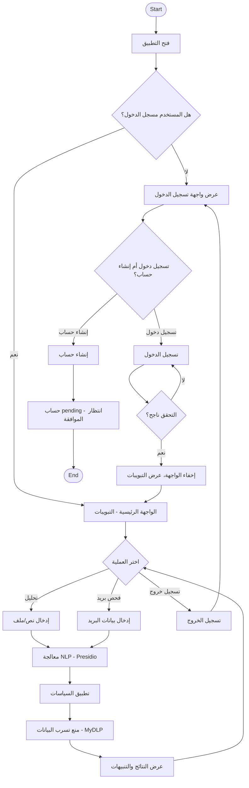
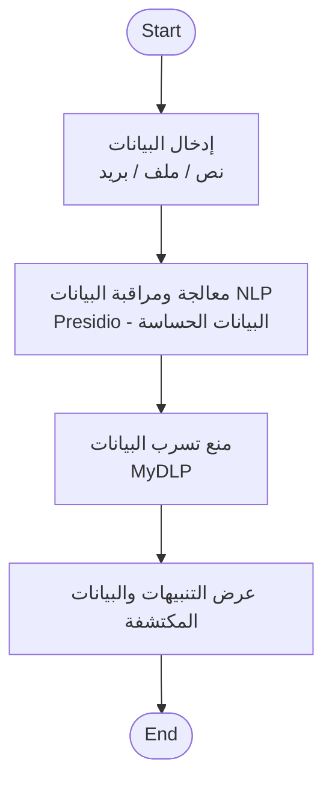

# مخطط النشاط — عمليات النظام
# Activity Diagram — System Operations

## نظرة عامة

هذا المستند يحدد مخطط النشاط (Activity Diagram) لعمليات النظام بناءً على التدفق الفعلي في المشروع.

---

## التدفق الفعلي (Actual Flow)

### 1. بداية الجلسة

```
[Start] → فتح التطبيق
         ↓
    هل المستخدم مسجل الدخول؟
         ├── لا → عرض واجهة تسجيل الدخول
         │         ├── تسجيل الدخول → التحقق → نجاح؟ → إخفاء الواجهة، عرض التبويبات
         │         │                    └── فشل → العودة لتسجيل الدخول
         │         └── إنشاء حساب → طلب يُنشأ (pending) → انتظار موافقة المدير
         │
         └── نعم → عرض الواجهة الرئيسية (التبويبات)
```

### 2. العمليات الرئيسية (بعد تسجيل الدخول)

| العملية | الوصف |
|---------|-------|
| **تحليل النصوص/الملفات** | إدخال نص أو رفع ملف → Presidio (NLP) → تطبيق السياسات → عرض النتائج والتنبيهات |
| **فحص البريد** | إدخال بيانات البريد → Presidio → تطبيق السياسات → منع/سماح → عرض النتيجة |
| **تسجيل الخروج** | مسح الجلسة → عرض واجهة تسجيل الدخول |

### 3. تدفق معالجة البيانات الحساسة

```
إدخال البيانات (نص/ملف/بريد)
         ↓
معالجة NLP (Presidio) — اكتشاف البيانات الحساسة
         ↓
تطبيق السياسات (Block, Alert, Encrypt)
         ↓
منع تسرب البيانات (MyDLP عند الحظر)
         ↓
عرض النتائج والتنبيهات
         ↓
[End]
```

---

## تصحيحات على المخطط الأصلي

| العنصر | المخطط الأصلي | التصحيح |
|--------|---------------|---------|
| **تسجيل الخروج** | مسار موازٍ من البداية | **تسجيل الخروج** يحدث فقط بعد تسجيل الدخول — من الواجهة الرئيسية |
| **هل يوجد حساب** | قرار أولي | **هل المستخدم مسجل الدخول؟** — التحقق من الجلسة (token) |
| **ادخال بيانات المستخدم** | بعد إنشاء حساب، ثم join مع Login | **إنشاء حساب** ينتهي بـ pending — لا يدخل مباشرة لمعالجة البيانات. **معالجة NLP** تحدث عند تحليل النصوص/الملفات/البريد |
| **الصفحة الرئيسية** | بعد Start مباشرة | تظهر فقط **بعد** تسجيل الدخول بنجاح |
| **اجراء عملية** | عام | **تفصيل:** تحليل نصوص، تحليل ملفات، فحص بريد، أو تسجيل خروج |

---

## مخطط Mermaid (Activity Diagram)



---

## مخطط مبسط (تدفق معالجة البيانات فقط)



---

## برومبت لـ ChatGPT لإنشاء المخطط

```
أنشئ مخطط نشاط (Activity Diagram) لعمليات نظام "Secure DLP - نظام حماية البيانات المتكامل" بالاعتماد على المواصفات التالية:

**التدفق:**
1. فتح التطبيق
2. قرار: هل المستخدم مسجل الدخول؟
   - لا: عرض واجهة تسجيل الدخول
     - تسجيل الدخول: التحقق → نجاح؟ → عرض التبويبات | فشل → العودة
     - إنشاء حساب: طلب يُنشأ (pending) → انتظار الموافقة
   - نعم: عرض الواجهة الرئيسية (التبويبات)
3. المستخدم يختار عملية:
   - تحليل نصوص/ملفات: إدخال → Presidio (NLP) → تطبيق السياسات → منع التسرب → عرض النتائج
   - فحص بريد: إدخال → Presidio → تطبيق السياسات → منع التسرب → عرض النتائج
   - تسجيل الخروج: العودة لواجهة تسجيل الدخول

**تصحيحات على المخطط الأصلي:**
- تسجيل الخروج لا يكون مساراً موازياً من البداية — يحدث بعد تسجيل الدخول
- إنشاء حساب لا يؤدي مباشرة لمعالجة البيانات — الحساب بحالة pending
- معالجة NLP تحدث عند تحليل النصوص/الملفات/البريد فقط

**المتطلبات:**
- استخدم تنسيق UML Activity Diagram
- أضف قرارات (diamonds) وفروع
- استخدم العربية والإنجليزية معاً
- إذا كنت تستخدم Mermaid: اكتب flowchart
```
