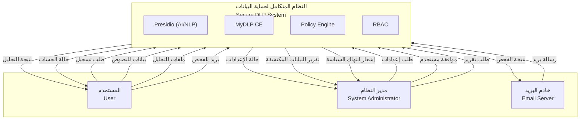

# مخطط السياق (Context Diagram) - نظام حماية البيانات المتكامل
# Secure Integrated Data Protection System

## نظرة عامة

هذا المستند يحدد مخطط السياق (Context Diagram) للنظام الفعلي بناءً على المكونات والتدفقات المطبقة في المشروع.

---

## الكيانات الخارجية (Actors)

| الكيان | الاسم بالإنجليزية | الوصف |
|--------|-------------------|-------|
| المستخدم | User | مستخدم عادي (User role) — يرسل نصوص/ملفات للتحليل، يراقب البريد |
| مدير النظام | System Administrator | مدير (Admin role) — يدير السياسات والمستخدمين والتنبيهات والتقارير |
| خادم البريد | Email Server | نظام خارجي يرسل رسائل بريدية للنظام لفحصها (webhook) |

---

## النظام المركزي

**الاسم:** النظام المتكامل لحماية البيانات / Secure DLP System

**المكونات الداخلية (تُذكر في المخطط):**
- **Presidio (AI/NLP)**: اكتشاف البيانات الحساسة والمعلومات الشخصية (PII)
- **MyDLP CE**: مراقبة ومنع تسرب البيانات
- **Policy Engine**: تطبيق السياسات (Block, Alert, Encrypt)
- **RBAC**: إدارة المستخدمين والصلاحيات

---

## تدفقات البيانات (Data Flows)

### من/إلى المستخدم (User)

| الاتجاه | التدفق | الوصف |
|---------|--------|-------|
| User → System | طلب تسجيل | إنشاء حساب جديد |
| User → System | بيانات للنصوص | نص للتحليل (Text Analysis) |
| User → System | ملفات للتحليل | ملفات PDF, DOCX, TXT, XLSX (File Analysis) |
| User → System | بريد إلكتروني للفحص | محتوى بريد للتحقق (مراقبة البريد) |
| System → User | نتيجة التحليل | الكيانات المكتشفة، السياسات المطبقة |
| System → User | حالة الحساب | موافقة/رفض التسجيل، حالة الجلسة |

### من/إلى مدير النظام (Admin)

| الاتجاه | التدفق | الوصف |
|---------|--------|-------|
| Admin → System | طلب إعدادات | إعداد السياسات، القواعد، الإعدادات |
| Admin → System | موافقة مستخدم | الموافقة على طلبات التسجيل |
| Admin → System | طلب تقرير | طلب تقارير المراقبة والتنبيهات |
| System → Admin | حالة الإعدادات | تأكيد تطبيق الإعدادات |
| System → Admin | تقرير البيانات المكتشفة | إحصائيات، تنبيهات، سجل العمليات |
| System → Admin | إشعار انتهاك السياسة | تنبيه فوري عند انتهاك (Policy Violation) |

### من/إلى خادم البريد (Email Server)

| الاتجاه | التدفق | الوصف |
|---------|--------|-------|
| Email Server → System | رسالة بريد | محتوى البريد (من، إلى، موضوع، نص، مرفقات) |
| System → Email Server | نتيجة الفحص | حظر/سماح، حالة التحليل (عبر MyDLP) |

---

## رسم توضيحي نصي (للتوضيح فقط)

```
                    ┌─────────────────────────────────────────────────────────┐
                    │     النظام المتكامل لحماية البيانات                      │
                    │     Secure DLP System                                    │
                    │                                                          │
                    │  Presidio (AI/NLP) | MyDLP CE | Policy Engine | RBAC    │
                    └─────────────────────────────────────────────────────────┘
                         ▲  │  ▲  │  ▲  │  ▲  │  ▲  │  ▲  │
                         │  │  │  │  │  │  │  │  │  │  │  │
    ┌─────────────┐      │  │  │  │  │  │  │  │  │  │  │  │      ┌──────────────┐
    │  المستخدم   │──────┘  │  │  │  │  │  │  │  │  │  │  └──────│ مدير النظام  │
    │  User       │         │  │  │  │  │  │  │  │  │  │         │ Admin        │
    └─────────────┘         │  │  │  │  │  │  │  │  │  │         └──────────────┘
         ▲  │               │  │  │  │  │  │  │  │  │  │
         │  │               │  │  │  │  │  │  │  │  │  │
         │  │               └──┴──┴──┴──┴──┴──┴──┴──┴──┘
         │  │
    ┌────┴──┴────┐
    │ خادم البريد │
    │ Email Server│
    └────────────┘
```

---

## ملاحظات للتصميم

1. **النظام المركزي**: مستطيل كبير في المنتصف، يحتوي على العبارات: Presidio, MyDLP, Policy Engine, RBAC
2. **الأسهم**: كل سهم مُسمى باسم التدفق (بالعربية أو الإنجليزية حسب المخطط)
3. **الألوان**: يمكن تمييز التدفقات الواردة (داخلة) باللون الأزرق والتدفقات الصادرة باللون الأخضر
4. **الترقيم**: يمكن ترقيم التدفقات لتسهيل الإشارة إليها في الوثائق

---

## برومبت لـ ChatGPT لإنشاء المخطط

انسخ النص التالي إلى ChatGPT لإنشاء مخطط السياق:

```
أنشئ مخطط سياق (Context Diagram) لنظام "Secure DLP - نظام حماية البيانات المتكامل" بالاعتماد على المواصفات التالية:

**النظام المركزي:**
- الاسم: النظام المتكامل لحماية البيانات / Secure DLP System
- المكونات: Presidio (AI/NLP)، MyDLP CE، Policy Engine، RBAC

**الكيانات الخارجية والتدفقات:**

1. **المستخدم (User):**
   - إلى النظام: طلب تسجيل، بيانات للنصوص (Text Analysis)، ملفات للتحليل (File Analysis)، بريد إلكتروني للفحص
   - من النظام: نتيجة التحليل، حالة الحساب

2. **مدير النظام (Admin):**
   - إلى النظام: طلب إعدادات، موافقة مستخدم، طلب تقرير
   - من النظام: حالة الإعدادات، تقرير البيانات المكتشفة، إشعار انتهاك السياسة

3. **خادم البريد (Email Server):**
   - إلى النظام: رسالة بريد (محتوى البريد مع المرفقات)
   - من النظام: نتيجة الفحص (حظر/سماح)

**المتطلبات:**
- استخدم تنسيق Context Diagram القياسي (مستطيل مركزي + مستطيلات للكيانات الخارجية)
- أضف أسهماً مُسمّاة لكل تدفق
- اجعل التصميم واضحاً واحترافياً
- يمكن استخدام العربية والإنجليزية معاً
- إذا كنت تستخدم DALL-E أو أداة رسم: أنشئ صورة للمخطط
- إذا كنت تستخدم Mermaid أو نصاً: اكتب كود Mermaid أو وصفاً تفصيلياً للرسم
```

---

## مخطط Mermaid (جاهز للاستخدام)

يمكنك نسخ الكود التالي وعرضه في [Mermaid Live Editor](https://mermaid.live) أو أي عارض يدعم Mermaid:


