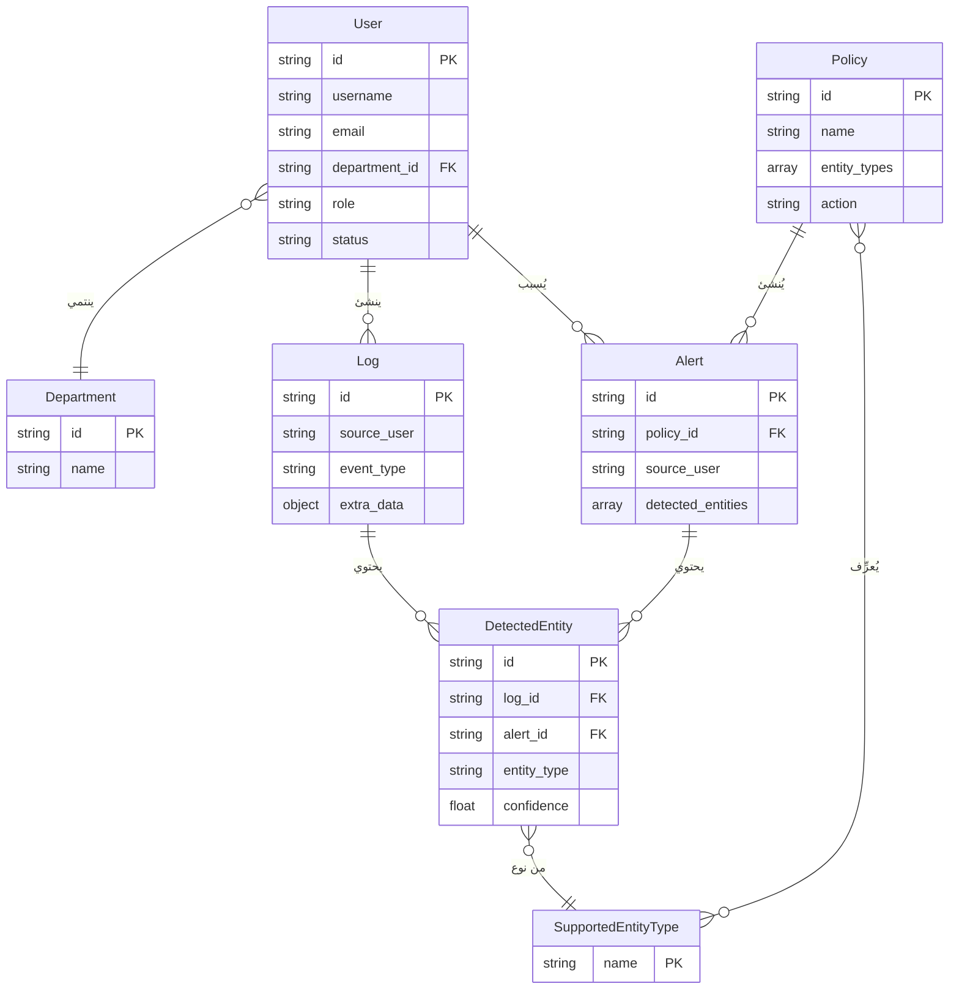

# مخطط علاقات الكيانات (ERD) — نظام حماية البيانات المتكامل
# Entity-Relationship Diagram — Secure Integrated Data Protection System

## نظرة عامة

هذا المستند يحدد مخطط علاقات الكيانات (ERD) للنظام بناءً على النماذج الفعلية في المشروع (MongoDB/Beanie).

---

## الكيانات (Entities)

| الكيان | Collection | الوصف |
|--------|------------|-------|
| User | users | المستخدمون (Admin, User, Manager) |
| Department | departments | الأقسام التنظيمية |
| Policy | policies | سياسات حماية البيانات |
| Alert | alerts | التنبيهات الناتجة عن انتهاك السياسات |
| Log | logs | سجلات العمليات والأنشطة |
| DetectedEntity | detected_entities | الكيانات المكتشفة (PII) المخزنة للتدقيق |
| SupportedEntityType | (config) | أنواع الكيانات المدعومة (من config/ENTITY_RECOGNITION_SPEC) |

**ملاحظة:** `SupportedEntityType` ليس collection منفصلاً — هو قائمة ثابتة في الإعدادات ويُشار إليها عبر `Policy.entity_types`.

---

## العلاقات والكارديناليتي (Relationships)

### 1. User — Department
- **العلاقة:** User ينتمي إلى Department
- **الكارديناليتي:** User (M) — ينتمي — (1) Department
- **التنفيذ:** `User.department_id` → `Department.id`
- **ملاحظة:** department_id اختياري (Optional)

### 2. User — Log
- **العلاقة:** User ينشئ/يمتلك Logs
- **الكارديناليتي:** User (1) — ينشئ — (M) Log
- **التنفيذ:** `Log.source_user` (string — اسم المستخدم أو معرفه)
- **ملاحظة:** لا يوجد FK صريح؛ الربط عبر source_user

### 3. User — Alert
- **العلاقة:** User يُسبب/ينشئ Alerts
- **الكارديناليتي:** User (1) — يُسبب — (M) Alert
- **التنفيذ:** `Alert.source_user` (string)
- **تصحيح:** المخطط الأصلي كان معكوساً (Users M — Alerts 1)

### 4. Policy — Alert
- **العلاقة:** Alert يُنشأ بسبب انتهاك Policy
- **الكارديناليتي:** Alert (M) — يُنشأ بسبب — (1) Policy
- **التنفيذ:** `Alert.policy_id` → `Policy.id`
- **ملاحظة:** المخطط الأصلي قال "Alerts تمتلك Policies" — الصحيح: Alerts تُنشأ بسبب Policy

### 5. Log — DetectedEntity
- **العلاقة:** Log يحتوي DetectedEntity
- **الكارديناليتي:** Log (1) — يحتوي — (M) DetectedEntity
- **التنفيذ:** `DetectedEntity.log_id` → `Log.id`
- **ملاحظة:** Log أيضاً يخزن entities في `extra_data.entities_detected` (embedded)

### 6. Alert — DetectedEntity
- **العلاقة:** Alert يحتوي DetectedEntity
- **الكارديناليتي:** Alert (1) — يحتوي — (M) DetectedEntity
- **التنفيذ:** `DetectedEntity.alert_id` → `Alert.id`؛ و`Alert.detected_entities` (embedded list)

### 7. Policy — SupportedEntityType
- **العلاقة:** Policy يُعرِّف أنواع كيانات مراقبة
- **الكارديناليتي:** Policy (M) — يُعرِّف — (M) SupportedEntityType
- **التنفيذ:** `Policy.entity_types` (List[str]) — أسماء مثل PERSON, CREDIT_CARD, PHONE_NUMBER
- **ملاحظة:** SupportedEntityType من config وENTITY_RECOGNITION_SPEC

### 8. DetectedEntity — SupportedEntityType
- **العلاقة:** DetectedEntity هو instance من نوع كيان
- **الكارديناليتي:** DetectedEntity (M) — من نوع — (1) SupportedEntityType
- **التنفيذ:** `DetectedEntity.entity_type` (string) — يطابق أحد الأسماء في القائمة

---

## علاقة خاطئة في المخطط الأصلي

| العلاقة الأصلية | السبب |
|-----------------|-------|
| Users (M) — ينتمي — (1) Alerts | معكوسة؛ الصحيح: User (1) — يُسبب — (M) Alerts |
| Users (1) — ينتمي — (1) SupportedEntityTypes | غير منطقية؛ المستخدمون لا ينتمون لأنواع الكيانات |

---

## مخطط Mermaid (ERD)



---

## برومبت لـ ChatGPT لإنشاء المخطط

```
أنشئ مخطط علاقات كيانات (ERD) لنظام "Secure DLP - نظام حماية البيانات المتكامل" بالاعتماد على المواصفات التالية:

**الكيانات:**
- User (المستخدمون)
- Department (الأقسام)
- Policy (السياسات)
- Alert (التنبيهات)
- Log (السجلات)
- DetectedEntity (الكيانات المكتشفة)
- SupportedEntityType (أنواع الكيانات المدعومة — من الإعدادات)

**العلاقات:**
1. User (M) — ينتمي — (1) Department
2. User (1) — ينشئ — (M) Log
3. User (1) — يُسبب — (M) Alert
4. Policy (1) — يُنشئ بسبب انتهاكه — (M) Alert
5. Policy (M) — يُعرِّف — (M) SupportedEntityType
6. Log (1) — يحتوي — (M) DetectedEntity
7. Alert (1) — يحتوي — (M) DetectedEntity
8. DetectedEntity (M) — من نوع — (1) SupportedEntityType

**المتطلبات:**
- استخدم تنسيق ERD القياسي (Chen أو Crow's Foot)
- أضف الكارديناليتي (1, M) بوضوح
- اجعل التصميم واضحاً واحترافياً
- يمكن استخدام العربية والإنجليزية معاً
- إذا كنت تستخدم Mermaid: اكتب كود erDiagram
- إذا كنت تستخدم أداة رسم: أنشئ صورة للمخطط
```
