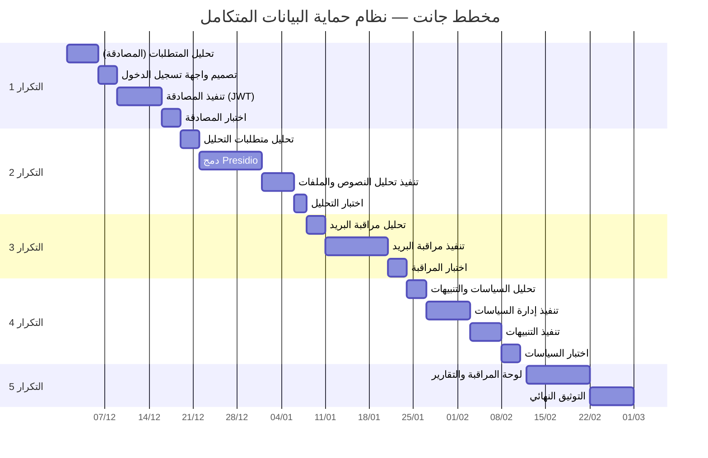

# مخطط جانت — نظام حماية البيانات المتكامل
# Gantt Chart — Integrated Data Protection System

## نظرة عامة

مخطط جانت للمشروع باستخدام **المنهجية التكرارية** — كل تكرار يتضمن تحليل، تصميم، تنفيذ، واختبار.

### رسم توضيحي


---

## مخطط Mermaid (Gantt Chart)

يمكن عرضه في [Mermaid Live Editor](https://mermaid.live) أو أي عارض يدعم Mermaid:



---

## مخطط مبسط (جدول نصي)

```
ديسمبر 2025          يناير 2026          فبراير 2026
أ1 أ2 أ3 أ4 أ5      أ1 أ2 أ3 أ4 أ5      أ1 أ2 أ3 أ4 أ5
│  │  │  │  │      │  │  │  │  │      │  │  │  │  │
├──┼──┼──┼──┼──────┼──┼──┼──┼──┼──────┼──┼──┼──┼──┤
│████████████│      │              │      │              │  تحليل المتطلبات
│            │██████│              │      │              │  تصميم النظام
│            │      │██████████████│      │              │  التنفيذ (تكرار 1-3)
│            │      │              │██████│              │  التنفيذ (تكرار 4-5)
│            │      │              │      │██████████████│  الاختبار والتوثيق
└────────────┴──────┴──────────────┴──────┴──────────────┘
```

---

## جدول المهام والمدد

| # | المهمة | البداية | النهاية | المدة |
|---|--------|---------|---------|-------|
| 1 | تحليل المتطلبات | 01/12 | 05/12 | 5 أيام |
| 2 | تصميم النظام | 06/12 | 15/12 | 10 أيام |
| 3 | التكرار 1: المصادقة | 16/12 | 05/01 | 3 أسابيع |
| 4 | التكرار 2: تحليل النصوص/الملفات | 06/01 | 26/01 | 3 أسابيع |
| 5 | التكرار 3: مراقبة البريد | 27/01 | 10/02 | 2 أسبوع |
| 6 | التكرار 4: السياسات والتنبيهات | 11/02 | 25/02 | 2 أسبوع |
| 7 | التكرار 5: لوحة التحكم والتوثيق | 26/02 | 15/03 | 3 أسابيع |

---

## رسم توضيحي (ASCII)

```
المشروع: نظام حماية البيانات المتكامل
المدة الإجمالية: ~14 أسبوعاً (ديسمبر — مارس)

التكرار 1 ████████████░░░░░░░░░░░░░░░░░░  المصادقة + واجهة الدخول
التكرار 2 ░░░░░░░░░░████████████░░░░░░░░  Presidio + تحليل النصوص/الملفات
التكرار 3 ░░░░░░░░░░░░░░░░░░████████░░░░  مراقبة البريد
التكرار 4 ░░░░░░░░░░░░░░░░░░░░░░████████  السياسات + التنبيهات
التكرار 5 ░░░░░░░░░░░░░░░░░░░░░░░░░░████  لوحة التحكم + التوثيق

         ديسمبر    يناير     فبراير    مارس
```

---

## برومبت لـ ChatGPT لتصميم مخطط جانت

انسخ النص التالي والصقه في ChatGPT:

```
أنشئ مخطط جانت (Gantt Chart) احترافي لنظام "حماية البيانات المتكامل - Integrated Data Protection System" بالاعتماد على المواصفات التالية:

**عنوان المشروع:** نظام حماية البيانات المتكامل (Secure DLP)

**المنهجية:** تكرارية (Iterative) — كل تكرار يتضمن تحليل، تصميم، تنفيذ، اختبار

**الفترة الزمنية:** ديسمبر 2025 — مارس 2026 (حوالي 14 أسبوعاً)

**المهام والمدد:**

1. تحليل المتطلبات — 5 أيام (01/12 - 05/12)
2. تصميم النظام — 10 أيام (06/12 - 15/12)
3. التكرار 1 — المصادقة وواجهة تسجيل الدخول: 3 أسابيع (16/12 - 05/01)
4. التكرار 2 — تحليل النصوص والملفات (Presidio): 3 أسابيع (06/01 - 26/01)
5. التكرار 3 — مراقبة البريد الإلكتروني: 2 أسبوع (27/01 - 10/02)
6. التكرار 4 — السياسات والتنبيهات: 2 أسبوع (11/02 - 25/02)
7. التكرار 5 — لوحة التحكم والتوثيق: 3 أسابيع (26/02 - 15/03)

**المتطلبات:**
- استخدم تنسيق Gantt Chart القياسي (محور زمني أفقي، أشرطة أفقية للمهام)
- أضف ألواناً مميزة لكل تكرار أو مرحلة
- استخدم العربية والإنجليزية معاً (أو العربية فقط)
- اجعل التصميم واضحاً واحترافياً ومناسباً للتقرير الأكاديمي
- إذا كنت تستخدم DALL-E أو أداة إنشاء صور: أنشئ صورة للمخطط
- إذا كنت تستخدم Mermaid: اكتب كود gantt كامل
- إذا كنت تستخدم HTML/SVG: أنشئ مخطط تفاعلي
```
