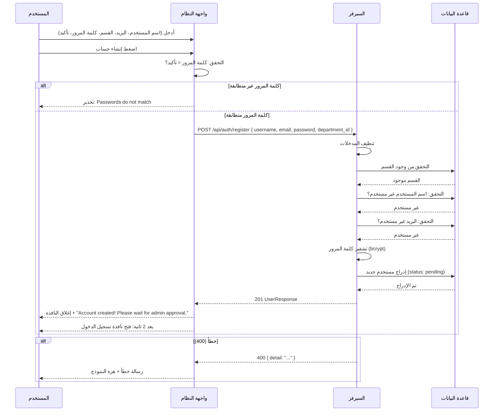

# المخطط التسلسلي — عمليات إنشاء حساب جديد
# Sequence Diagram — New Account Creation Process

## نظرة عامة

هذا المستند يحدد المخطط التسلسلي (Sequence Diagram) لعمليات إنشاء حساب جديد بناءً على التدفق الفعلي في المشروع.

---

## المشاركون (Participants)

| المشارك | الاسم بالإنجليزية | الوصف |
|---------|-------------------|-------|
| المستخدم | User | الزائر الذي ينشئ حساباً جديداً |
| واجهة النظام | System Interface | الواجهة الأمامية (Frontend — HTML/JS) |
| السيرفر | Server | الواجهة الخلفية (Backend — FastAPI) |
| قاعدة البيانات | Database | MongoDB (مجموعة users) |

---

## التدفق الفعلي (Actual Flow)

### 1. إدخال البيانات

المستخدم يُدخل:
- **اسم المستخدم** (Username)
- **البريد الإلكتروني** (Email)
- **القسم** (Department — من قائمة منسدلة)
- **كلمة المرور** (Password)
- **تأكيد كلمة المرور** (Confirm Password)

ثم يضغط زر **إنشاء حساب** (Register).

### 2. التحقق من الواجهة (Frontend)

- التحقق من تطابق كلمة المرور وتأكيدها
- إذا لم تتطابق: عرض تحذير، البقاء في النموذج

### 3. الطلب إلى السيرفر

```
POST /api/auth/register
Body: { username, email, password, department_id }
```

### 4. معالجة السيرفر

| الخطوة | الوصف |
|--------|-------|
| 1 | تنظيف المدخلات (Sanitize) |
| 2 | التحقق من وجود القسم (Department) |
| 3 | التحقق من عدم تكرار اسم المستخدم |
| 4 | التحقق من عدم تكرار البريد الإلكتروني |
| 5 | تشفير كلمة المرور (bcrypt) |
| 6 | إنشاء مستخدم جديد (status: pending, is_active: false) |
| 7 | حفظ المستخدم في قاعدة البيانات |

### 5. الاستجابة

**نجاح (201):** إرجاع `UserResponse` (id, username, email, role, status, department_name, ...)

**فشل (400):** رسالة خطأ (مثل: Username already registered, Invalid department)

### 6. رد فعل الواجهة

**عند النجاح:**
- إغلاق نافذة التسجيل
- عرض رسالة: "Account created successfully! Please wait for admin approval."
- بعد ثانيتين: فتح نافذة تسجيل الدخول

**عند الفشل:**
- عرض رسالة الخطأ
- هزة للنموذج (shake)
- البقاء في واجهة إنشاء الحساب

---

## تصحيحات على المخطط الأصلي

| العنصر | المخطط الأصلي | التصحيح |
|--------|---------------|---------|
| المدخلات | الايميل أو رقم الهاتف، كلمة السر، اداة التحقق | **اسم المستخدم، البريد، القسم، كلمة المرور، تأكيد كلمة المرور** — لا يوجد أداة تحقق (CAPTCHA) |
| عند النجاح | الصفحة الرئيسية | **رسالة نجاح + نافذة تسجيل الدخول** — لا يُوجّه إلى الصفحة الرئيسية لأن الحساب pending |
| التحقق | عام | **تفصيل:** تنظيف، التحقق من القسم، التحقق من عدم التكرار |

---

## مخطط Mermaid (Sequence Diagram)



---

## برومبت لـ ChatGPT لإنشاء المخطط

```
أنشئ مخطط تسلسلي (Sequence Diagram) لعمليات إنشاء حساب جديد في نظام "Secure DLP" بالاعتماد على المواصفات التالية:

**المشاركون:**
- المستخدم (User)
- واجهة النظام (System Interface / Frontend)
- السيرفر (Server / Backend API)
- قاعدة البيانات (Database / MongoDB)

**التدفق:**
1. المستخدم يُدخل: اسم المستخدم، البريد الإلكتروني، القسم، كلمة المرور، تأكيد كلمة المرور
2. المستخدم يضغط "إنشاء حساب"
3. الواجهة تتحقق من تطابق كلمة المرور
4. الواجهة ترسل POST /api/auth/register
5. السيرفر: ينظف المدخلات، يتحقق من القسم، يتحقق من عدم تكرار الاسم/البريد، يشفر كلمة المرور، يُدرج المستخدم
6. عند النجاح: الواجهة تعرض "Account created! Please wait for admin approval" ثم تفتح نافذة تسجيل الدخول
7. عند الفشل: الواجهة تعرض رسالة الخطأ وتبقى في نموذج التسجيل

**ملاحظة:** لا يوجد "أداة تحقق" (CAPTCHA). عند النجاح لا يُوجّه إلى الصفحة الرئيسية — الحساب بحالة pending ويحتاج موافقة المدير.

**المتطلبات:**
- استخدم تنسيق UML Sequence Diagram
- أضف alt للفروع (نجاح/فشل)
- استخدم العربية والإنجليزية معاً
- إذا كنت تستخدم Mermaid: اكتب sequenceDiagram
```
