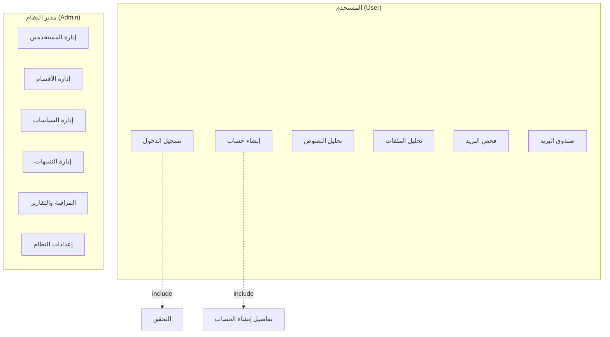
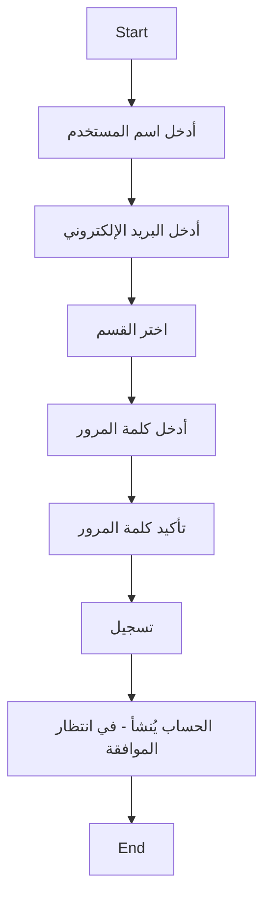

# مخطط حالات الاستخدام — نظام حماية البيانات المتكامل
# Use Case Diagram — Secure Integrated Data Protection System

## نظرة عامة

هذا المستند يحدد مخطط حالات الاستخدام (Use Case) وتدفق إنشاء الحساب بناءً على الوظائف الفعلية في المشروع.

---

## الفاعلون (Actors)

| الفاعل | الاسم بالإنجليزية | الوصف |
|--------|-------------------|-------|
| المستخدم | User | مستخدم عادي (regular) — تحليل، مراقبة بريد |
| مدير النظام | System Administrator | مدير (admin) — صلاحيات كاملة |
| مدير القسم | Department Manager | مدير (manager) — إدارة مستخدمي القسم فقط |

**تصحيح المخطط الأصلي:** "العميل" يُستبدل بـ "المستخدم"؛ يُضاف "مدير القسم" كفاعل منفصل.

---

## حالات الاستخدام — المستخدم (User)

| الحالة | العربية | الوصف | Include |
|--------|---------|-------|---------|
| تسجيل الدخول | Login | تسجيل الدخول بالاسم وكلمة المرور | التحقق (Verification) |
| إنشاء حساب | Create Account | تسجيل طلب حساب جديد |
| تحليل النصوص | Text Analysis | إدخال نص واكتشاف البيانات الحساسة |
| تحليل الملفات | File Analysis | رفع ملف (PDF, DOCX, TXT, XLSX) لاكتشاف PII |
| فحص البريد | Test Email | إرسال بريد تجريبي للفحص |
| صندوق البريد | Email Inbox | عرض البريد المرسل للمستخدم |

---

## حالات الاستخدام — مدير النظام (Admin)

| الحالة | العربية | الوصف | Include |
|--------|---------|-------|---------|
| إدارة المستخدمين | User Management | عرض، موافقة، رفض، تحديث المستخدمين | قائمة المستخدمين، الموافقة |
| إدارة الأقسام | Department Management | إدارة الأقسام التنظيمية |
| إدارة السياسات | Policy Management | إنشاء وتعديل سياسات الحماية |
| إدارة التنبيهات | Alerts Management | عرض وحل التنبيهات |
| المراقبة والتقارير | Monitoring & Reports | عرض تقارير المراقبة، سجل العمليات، إحصائيات |
| إعدادات النظام | System Settings | إعدادات النظام (مثل MyDLP) |

**تصحيح المخطط الأصلي:** إزالة "بيانات العميل" كحالة منفصلة؛ توحيد "الاعدادات" و"تغيير الاعدادات"؛ إزالة "الوثائق المطلوبة"، "الطلبات" كحالات مستقلة غير مطبقة.

---

## مخطط Mermaid (Use Case)



---

## تدفق إنشاء حساب جديد (Activity Flow)

### الخطوات الفعلية في المشروع

| # | الخطوة | العربية | الوصف |
|---|--------|---------|-------|
| 1 | Enter Username | أدخل اسم المستخدم | 3–100 حرف |
| 2 | Enter Email | أدخل البريد الإلكتروني | بريد صالح |
| 3 | Select Department | اختر القسم | القسم التنظيمي (مطلوب) |
| 4 | Enter Password | أدخل كلمة المرور | 6 أحرف على الأقل |
| 5 | Confirm Password | تأكيد كلمة المرور | مطابقة كلمة المرور |
| 6 | Register | تسجيل | إرسال الطلب — الحساب يُنشأ بحالة pending |

### تصحيحات على المخطط الأصلي

| المخطط الأصلي | التصحيح |
|---------------|---------|
| ادخل الاسم الأول | **إزالة** — المشروع يستخدم اسم مستخدم واحد |
| ادخل الاسم الثاني | **إزالة** — لا يوجد |
| ادخل رقم الهاتف | **إزالة** — غير موجود في النموذج |
| ادخل البريد الالكتروني | ✓ صحيح |
| ادخل كلمة السر | ✓ صحيح |
| تاكيد كلمة السر | ✓ صحيح |
| تسجيل | ✓ صحيح |
| — | **إضافة:** اختر القسم (Department) |

### مخطط Mermaid (Activity Flow)



---

## برومبت لـ ChatGPT لإنشاء المخطط

```
أنشئ مخطط حالات الاستخدام (Use Case Diagram) ومخطط تدفق إنشاء الحساب لنظام "Secure DLP - نظام حماية البيانات المتكامل" بالاعتماد على المواصفات التالية:

**الفاعلون:**
- المستخدم (User)
- مدير النظام (System Administrator)
- مدير القسم (Department Manager)

**حالات الاستخدام للمستخدم:**
- تسجيل الدخول (include: التحقق)
- إنشاء حساب
- تحليل النصوص
- تحليل الملفات
- فحص البريد
- صندوق البريد

**حالات الاستخدام لمدير النظام:**
- إدارة المستخدمين
- إدارة الأقسام
- إدارة السياسات
- إدارة التنبيهات
- المراقبة والتقارير
- إعدادات النظام

**تدفق إنشاء الحساب (Activity Flow):**
1. أدخل اسم المستخدم
2. أدخل البريد الإلكتروني
3. اختر القسم
4. أدخل كلمة المرور
5. تأكيد كلمة المرور
6. تسجيل

**المتطلبات:**
- استخدم تنسيق UML Use Case
- أضف علاقات <<include>> حيث يناسب
- استخدم العربية والإنجليزية معاً
- إذا كنت تستخدم Mermaid: اكتب flowchart أو use case
- إذا كنت تستخدم أداة رسم: أنشئ صورة للمخطط
```
